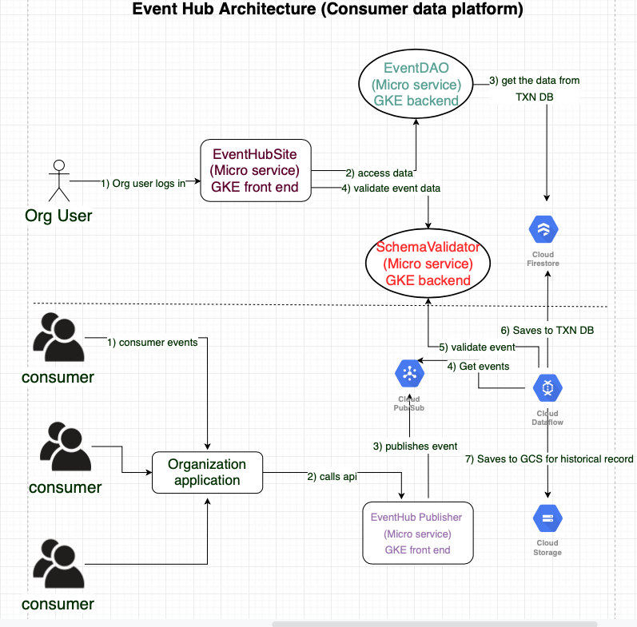

# event-hub-pubsub-consumer
This is a apache beam pipeline that reads the event hub messages from pubsub subscription and validates the messages against 
the event schema. If the messages are valid then saves them to firestore transactional database.

From the following architecture diagram you can see this pipeline between steps 6 & 7 in the consumer plane.

## Running the pipeline in local
mvn clean compile exec:java -Dexec.mainClass=com.eventhub.pubsub.consumer.PubsubPipeline -Dexec.args="--runner=DirectRunner --subscriptionName=projects/event-hub-249001/subscriptions/consumer-events-subscription"
